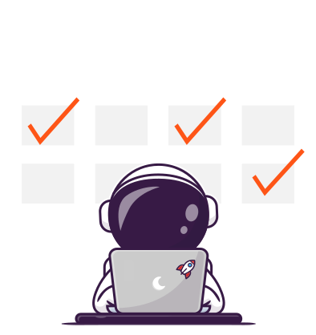
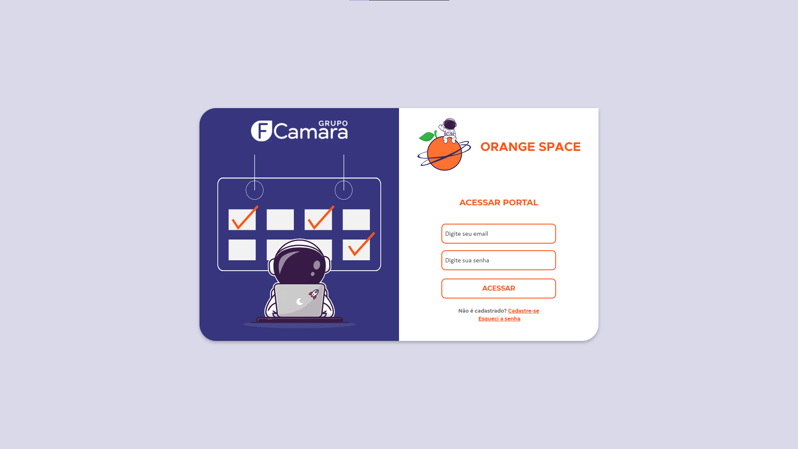
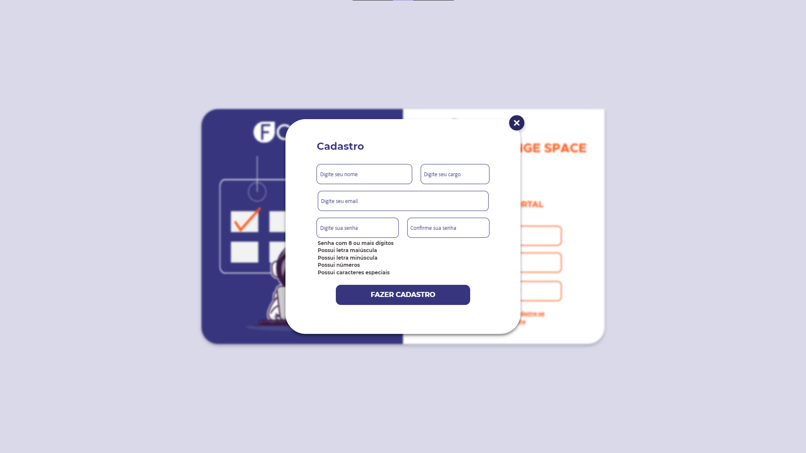

<div align='center'>
  
</div>

<div align='center'>
  
</div>

<br/>

<div align='center'>
  <a href="https://www.javascript.com/"></a>
  <a href="https://www.npmjs.com/package/react"></a>
</div>

<br />

<div align='center'>
  <a href="#-sobre">Sobre</a> •
  <a href="#-imagens">Imagens</a> •
  <a href="#-rodando-o-projeto">Rodando o Projeto</a> •
  <a href="#-tecnologias-utilizadas">Tecnologias Utilizadas</a> •
  <a href="#-participantes">Participantes</a>
</div>

## 📝 Sobre
Projeto desenvolvido pelo **squad 4** no hackathon do [Programa de Formação](https://digital.fcamara.com.br/programadeformacao) do [Grupo FCamara](https://www.fcamara.com.br/) onde criamos um sistema de login/registro para agendamento de idas ao ambiente de trabalho, apresentando todos os cuidados necessários para a volta do trabalho presencial.

Nosso sistema de agendamento é separado por: 
  - Filial: São Paulo ou Santos;
  - Tipo de Agendamento: Estação de Trabalho ou Sala de Reunião; 
  - Data: Dia que o ```Sangue Laranja``` deseja marcar para sua ida ao local de trabalho.
  
Assim podendo visualizar quais estações de trabalho e salas de reunião estão disponiveis ou ocupadas, e também fazer o cancelamento de agendamentos pela plataforma.

## 📸 Imagens
#### Imagem da tela de login / Imagem da tela de cadastro:
<div align='center'>
  
  
</div>

## 📂 Rodando o Projeto
```bash
# Clone o repositório
git clone https://github.com/gabrlcj/squad4-frontend

# Acesse a pasta do projeto 
# Rode o comando yarn no terminal dentro da pasta do projeto
yarn

# Após as instalações das dependências
# Rode o comando yarn dev para rodar o projeto
yarn dev

# Site estará rodando no localhost:3000
```

## 👨🏽‍💻 Tecnologias Utilizadas
<a href="https://"></a>
<a href="https://"></a>
<a href="https://"></a>
<a href="https://"></a>
<a href="https://"></a>

## 👤 Participantes
|_Gabriel Bittencourt_|_Felipe Lobo_|_Hugo Lemos_|_Danrley Senegalha_|
|---|---|---|---|
||||

#### Feito com 🧡 pelo squad4!